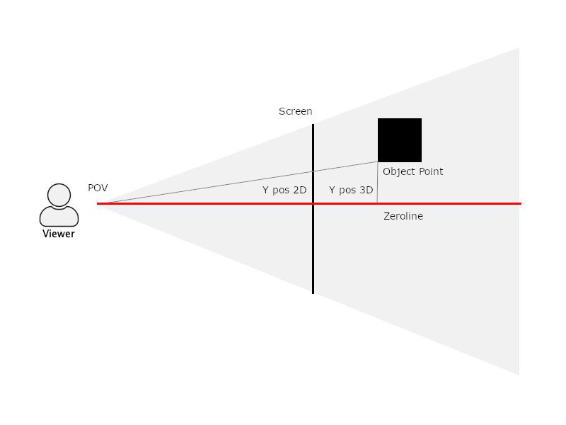

# TransformationApp3D

## What is it?

It is a project what I did during my qualification (2004 - 2006) while being sick for 1 or 2 weeks and was designed as a simple 3d rendering engine.

## The idea
The general idea was to create a 3 dimensional context which was capable of emulating a 3 dimensional view on a 2 dimensional device (screen).
For usual the industry uses for these cases 3d matrices, to determine how a point or an object would be mapped onto a 2d surface and also translated to new positions and angles. I did follow a different approach with angular functions.
Using Angular functions is not the ideal concept, it is way slower and also offer less capabilities for post-processing and such.
But I was thinking about how rendering of 3 dimensional view works and found a way to do it with angular functions.
Then I tried to bring the idea to paper and finally approve the concept with a visual application.

## Emulating a 3 dimensional view

When we look onto a 2 dimensional surface, like a screen for example, there is no depth information in it or to be more accurate, it is always the same value. The 3 dimensional awareness comes through the correct relations between objects drawn onto this surface and immerse when we move or change the view or the object changes its position or translation.
Our brain will combine the information and is processing a 3 dimensional world. So the key to make it feel like a 3 dimensional view is the perspective and proper representation of the 3 dimensional scenario.

A Viewer gets the information of a view when the light, which gets reflected from an object, comes into the eyes. To emulate a 3 dimensional view, we just need to represent the correct color information in the proper place on a 2 dimensional surface and our brain will let it feel 3 dimensional as long as the perspective is correct.
If you imagine a scenario with a simple object like an apple, just think about light beams coming from the apple hitting your eyes. Any light beam has color information and your brain is drawing the impression of the apple with this information.
To bring all this onto a 2d surface, just picture putting a pane of glass between your eyes and the apple. Then think of each light beam going through the pane of glass storing the color information given by the light beam.
To bring it down, mapping of a 3 dimensional scenario to a 2 dimensional surface means storing the color information of a cross-section of all light beams.

## Angular functions as 3d algorithm

There is a 2 dimensional surface represented by the screen, and we want to draw points onto this surface. Just to make it simpler, we focus on drawing points for now.
This point should represent the proper look in a 3 dimensional world. When we draw a line from the viewer towards a point in a 3 dimensional scenario, it represents the light beam containing the color information.
We need to figure out on which spot on this surface this point should be drawn, what means to determine the x and y coordinates of the point.

With angular functions you can determine the proper position for each dimension on the 2d surface with the following process:

- Figure out the 3d spot of the viewer (point of view), figure out the 3d spot of the point (object point) you want to draw on the 2d surface.
- The center of the view is the zero line, and you have to transform the 3d spots in relation to this line.
- Now we are going to determine the y location of the point onto the 2d surface. We have to figure out where the straight line (think of it as a light beam) between the viewer spot and the object point spot would hit the previously described pane of glass, which is represented by our 2d surface or screen.
- Imagine a triangle drawn from the point of view, towards the point in our 3d environment (which would be our light beam) and the 3rd point onto the zero line, where the angle between the connected lines of the 3rd point must have 90° degrees.
- Now angular functions come into play, and we can calculate with which y coordinate the 2d surface would be hit by the light beam.
- The drawn triangle is now going to be scaled, while having the spot on the point of view remain unchanged. We move the object point and the point onto the zero line til they are hitting the surface while keeping all angles of the triangle the same.
- With the rescaled triangle, we just have to measure/calculate the line from the point onto the zero line towards the object point, which represents the y coordinates onto our 2d surface.
- Now we are doing the same just for the x dimension, and finally we have proper x/y coordinates to draw the point onto our 2d surface.

## Controls

To interact with the scenario, you can zoom in and out, move and rotate the scenario.
This can be down as follows:

- press and hole 1 key, then click left mouse button and move the mouse to move the point of view
- press and hole 2 key, then click left mouse button and move the mouse to zoom the point of view
- press and hole 3 key, then click left mouse button and move the mouse to rotate around the scene

## known issues

- there is no backface culling implemented (prevent showing vertices or edges which should be covered by other objects)

## History

This project was created on 2005 with java 1.2. The intention was to just learn java and object-oriented programming through my qualification.
There are no modern software development concepts applied which are currently must haves like design patterns, SOLID or dependency injection.
The only concept I did try to follow was the MVC pattern by my personal understanding. To this time just learning java was the key, and I did try to do more than my qualification was about to teach me to this point.